# Understanding-TCP-IP-and-Firewall-Behavior-in-AWS-EC2
## Project Overview
This project demonstrates how TCP/IP communication works in AWS by deploying an Nginx web server on an Amazon EC2 instance and validating network connectivity using Netcat and Nmap. It also explores how AWS Security Groups (stateful firewall) and Network ACLs (stateless firewall) affect network traffic through a series of hands-on experiments.

Throughout the project, multiple validation methods were used to distinguish between application-level, operating system-level, and network-level connectivity. This provides a practical understanding of how AWS networking components interact to secure EC2 instances.

## Prerequisites

Before starting this project, ensure you have:
- An active AWS account.
- Basic understanding of TCP/IP and common network ports.
- A VPC with Internet Gateway connectivity.
- An EC2 Key Pair for SSH access.
- A local SSH client (PowerShell or Terminal).
- Internet access for downloading packages on EC2.

# Phase 1 - Environment Setup
## Step 1 - Launch an Amazon EC2 Instance
- Create an Amazon EC2 instance using Amazon Linux 2023 and t3.micro.
- Place the instance in a public subnet, assign a public IPv4 address,
- configure a Security Group that allows SSH (TCP 22) from your current public IP
- and HTTP (TCP 80) from the internet.
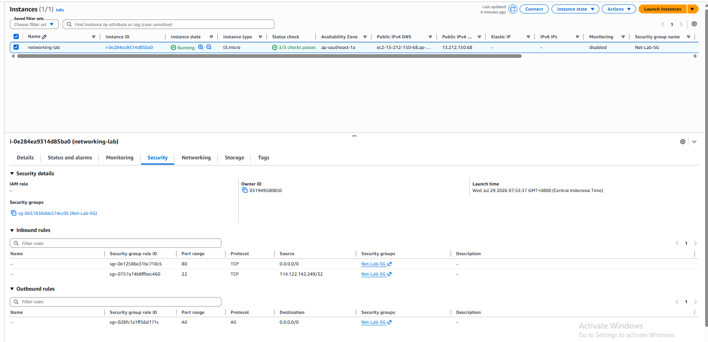
The EC2 instance is successfully deployed in a public subnet with a public IPv4 address. The associated Security Group allows SSH access for administration and HTTP access for web traffic.

## Step 2 - Connect to the EC2 Instance via SSH
Connect to the EC2 instance using your local terminal (PowerShell or Terminal) and verify that remote access is working correctly.

ssh -i your-key.pem ec2-user@your public IP
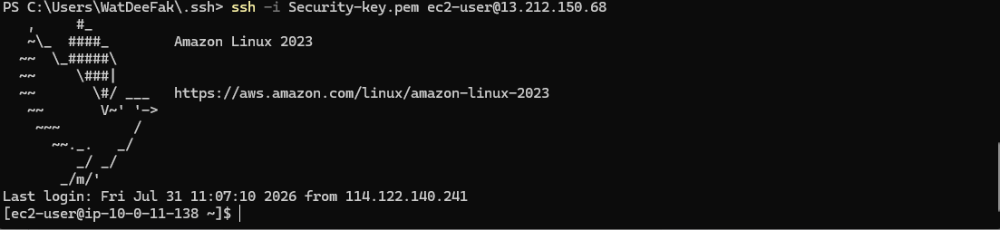
The EC2 instance is successfully accessed through SSH, confirming that the network configuration and Security Group allow secure remote administration.

## Step 3 - Install and Configure Nginx
Update the package repository, install Nginx, enable the service at boot, and start the web server.

- sudo dnf update -y
- sudo dnf install nginx -y
- sudo systemctl enable nginx
- sudo systemctl start nginx
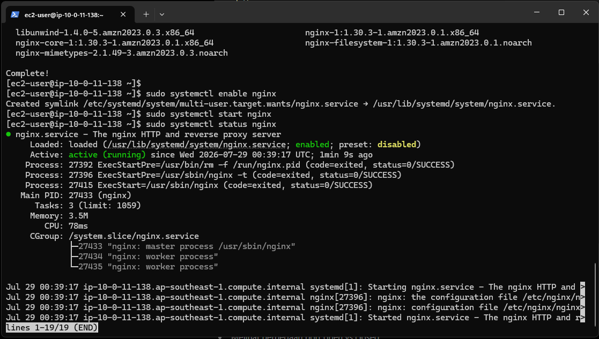
The Nginx service is active and running on the EC2 instance, confirming that the web server has been installed successfully.

## Step 4 - Verify HTTP Connectivity
Open the EC2 public IP address in a web browser to verify that the default Nginx welcome page is accessible.

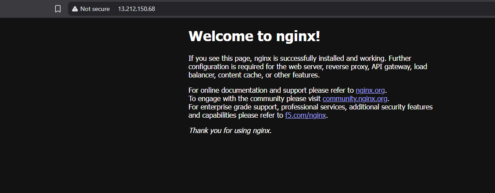
The default Nginx web page is successfully displayed through the EC2 public IP, confirming that HTTP connectivity between the client and the EC2 instance is functioning correctly.

# Phase 2 - Understanding TCP Connectivity with Netcat
## Objective
Install Netcat and use it to validate TCP connectivity between the client and the web server. This phase demonstrates how TCP connections behave when a service is listening on a port and when no service is available.

## Step 1 - Install Netcat
- Install Netcat on the Amazon Linux instance.
  
sudo dnf install nc -y
- Verify the installation.

nc -h
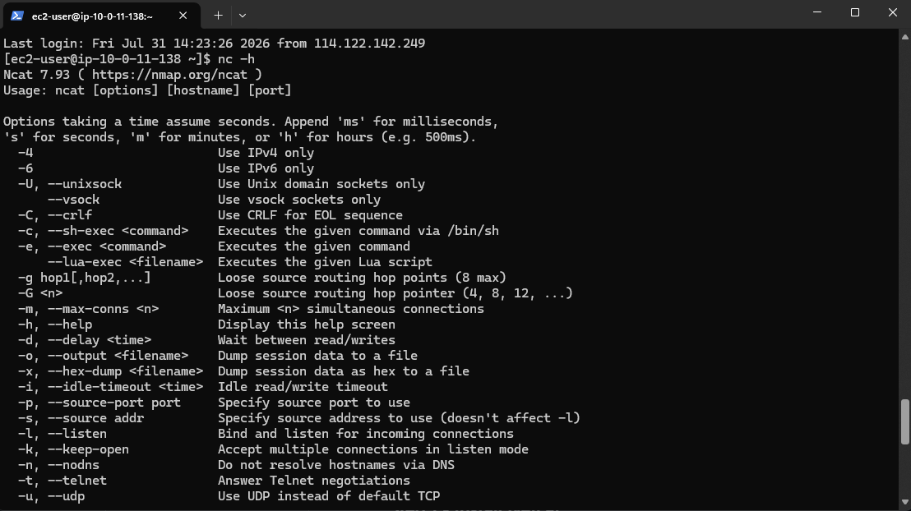
The Netcat utility is successfully installed and ready to perform TCP connectivity testing.

## Step 2 - Test TCP Connectivity to Port 80
- Verify that Nginx is accepting TCP connections on port 80.

nc -vz 127.0.0.1 80

nc -vz <Private-IP> 80

nc -vz <Public-IP> 80

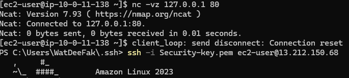

Netcat successfully establishes a TCP connection to the Nginx web server, confirming that the service is listening and accepting connections on port 80.

## Step 3 - Test an Unused TCP Port
- Attempt to connect to a port where no application is listening.

nc -vz 127.0.0.1 8080

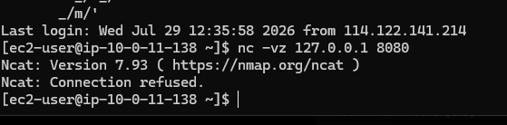

The connection is refused because no application is listening on port 8080, demonstrating the difference between an unavailable service and a firewall restriction.

## Step 4 - Compare the Results
- Observe the difference between the two tests.

| Port | Result             | Explanation                                                          |
| ---- | ------------------ | -------------------------------------------------------------------- |
| 80   | Connected          | Nginx is actively listening on the port.                             |
| 8080 | Connection Refused | The host is reachable, but no application is listening on that port. |

A comparison between successful and failed TCP connection attempts illustrates how Netcat reports different network conditions based on service availability.

## 💡 Lesson Learned
A successful TCP connection does not necessarily mean the application is functioning correctly—it simply confirms that the target service is accepting TCP connections. Likewise, a Connection Refused response indicates that the host is reachable but no application is listening on the specified port.

# Phase 3 - Discovering Open Ports with Nmap
## Objective
Install Nmap and perform port scanning against the EC2 instance using localhost, private IP, and public IP addresses. This phase demonstrates how network visibility changes depending on the traffic path and AWS firewall configuration.

## Step 1 - Install Nmap
- Install Nmap on the Amazon Linux EC2 instance.

sudo dnf install nmap -y

- Verify the installation.

nmap --version

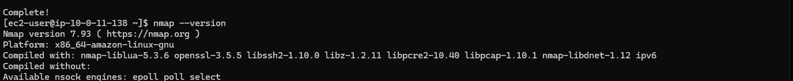
Nmap is successfully installed and ready to perform network and port scanning.

## Step 2 - Scan the Localhost Interface
- Scan the localhost interface to identify services currently listening on the EC2 instance.

nmap 127.0.0.1

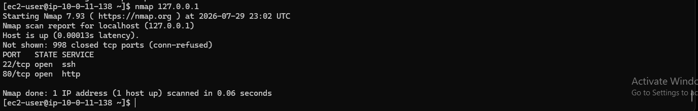
The scan shows that both SSH (22) and HTTP (80) services are listening locally on the EC2 instance.

## Step 3 - Scan the Private IP Address
- Retrieve the private IP address.

hostname -I
- Scan the private IP.

nmap Private-IP

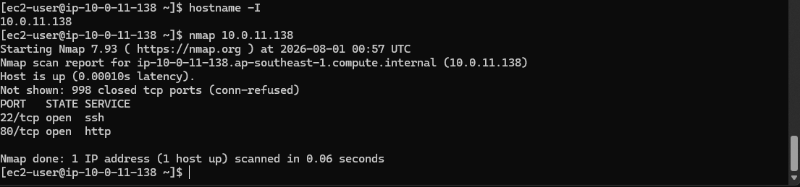
The private IP scan confirms that both SSH and HTTP services are reachable within the VPC network.

## Step 4 - Scan the Public IP Address
- Scan the EC2 public IP address.

nmap -Pn -p 22,80 Public-IP

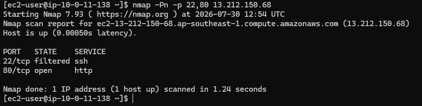

The public IP scan shows that HTTP is accessible, while SSH appears as filtered because the Security Group only allows SSH connections from the administrator's public IP.

## Step 5 - Compare the Scan Results
- Compare the results obtained from the three scans.

| Target     | Port 22  | Port 80 |
| ---------- | -------- | ------- |
| Localhost  | Open     | Open    |
| Private IP | Open     | Open    |
| Public IP  | Filtered | Open    |

The comparison highlights how scan results change depending on the network path and AWS Security Group configuration.

## 💡 Lesson Learned
Nmap reports the network perspective of a service rather than the service status itself. A service may be running and listening locally, yet appear filtered when scanned through the public network due to firewall rules such as AWS Security Groups.

# Phase 4 - Understanding Stateful Firewall Behavior with Security Groups
## Objective
Modify the Security Group to observe how a stateful firewall affects network accessibility without changing the application or operating system. This phase demonstrates that blocking network traffic does not stop the service itself.

## Step 1 - Verify the Baseline
- Before modifying the firewall, verify that the web server is accessible from a web browser.

http://Public-IP

The Nginx web server is successfully accessible through the EC2 public IP, confirming that HTTP traffic is currently allowed by the Security Group.

## Step 2 - Remove the HTTP Rule
- Open the EC2 Security Group and remove the inbound HTTP rule (TCP Port 80).
- Leave the SSH rule unchanged to maintain remote administration access.
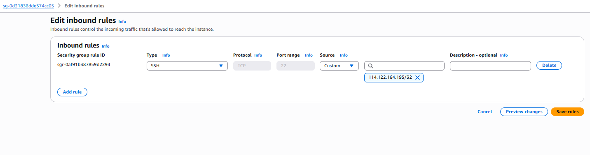

The HTTP inbound rule has been removed, preventing external HTTP traffic while preserving SSH access.

## Step 3 - Validate External Access
- Attempt to access the web server again from a web browser.

http://Public-IP
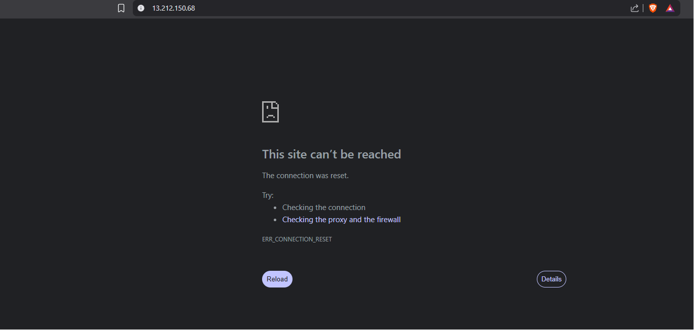

The browser can no longer reach the web server because HTTP traffic is blocked by the Security Group.

## Step 4 - Verify the Nginx Service
- Check whether the Nginx service is still running.

sudo systemctl status nginx

Although the website is no longer accessible from the internet, the Nginx service continues to run normally.

## Step 5 - Verify the Listening Port
- Display the listening TCP ports.

sudo ss -tulnp | grep nginx
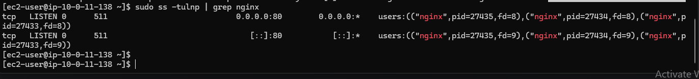

Nginx continues listening on TCP port 80, confirming that the operating system has not stopped the service.

## Step 6 - Test Local Connectivity
- Verify TCP connectivity from the EC2 instance itself.

nc -vz 127.0.0.1 80

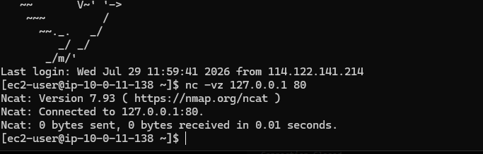

- Next, scan localhost.

Local TCP connectivity remains successful because localhost traffic does not depend on the Security Group.

## Step 7 - Scan the Public IP Address
- Perform another port scan against the EC2 public IP.

nmap -Pn -p 22,80 Public-IP
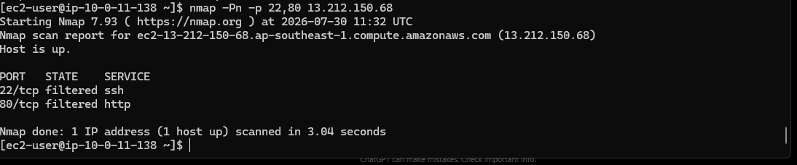

Both ports appear filtered from the public network, demonstrating that the Security Group blocks incoming connections before they reach the EC2 instance.

## Results Comparison

| Validation        | Before               | After                    |
| ----------------- | -------------------- | ------------------------ |
| Browser Access    | ✅ Available          | ❌ Blocked               |
| Nginx Service     | Running              | Running                  |
| Listening Port    | Port 80 LISTEN       | Port 80 LISTEN           |
| Local Netcat Test | Connected            | Connected                |
| Local Nmap Scan   | 22 Open, 80 Open     | 22 Open, 80 Open         |
| Public Nmap Scan  | 22 Filtered, 80 Open | 22 Filtered, 80 Filtered |

# Phase 5 - Understanding Stateless Firewall Behavior with Network ACLs
## Objective
Demonstrate how AWS Network ACLs evaluate inbound and outbound traffic independently. This phase compares inbound and outbound filtering to explain why Network ACLs are considered stateless firewalls.

## Step 1 - Restore the Security Group Configuration
- Before testing the Network ACL, restore the Security Group by adding back the HTTP inbound rule.

| Type | Port   | Source    |
| ---- | ------ | --------- |
| HTTP | TCP 80 | 0.0.0.0/0 |

- Verify that the web server is accessible again.

http://Public-IP
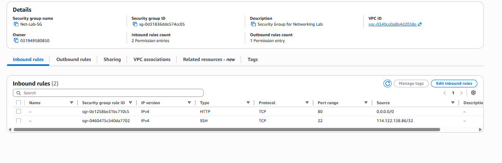

The HTTP inbound rule is restored, allowing the web server to become accessible again before starting the Network ACL experiment.

## Step 2 - Validate the Baseline
- Confirm that the environment has returned to its normal state.

nmap -Pn -p 22,80 Public-IP

The scan confirms that HTTP traffic is reachable again while SSH remains restricted by the Security Group.

# Experiment 1 - Blocking Inbound HTTP
## Step 3 - Create an Inbound DENY Rule
- Edit the Network ACL inbound rules.

| Rule | Type | Port | Source    | Action |
| ---: | ---- | ---- | --------- | ------ |
|   90 | HTTP | 80   | 0.0.0.0/0 | DENY   |

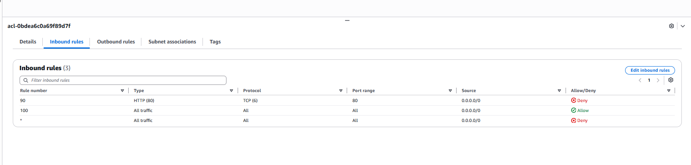

A higher-priority DENY rule is added to block inbound HTTP traffic before the default ALLOW rule is evaluated.

## Step 4 - Validate the Results
- Perform the following validations.

1. Browsing http://Public-IP
2. Check the Nginx service. > sudo systemctl status nginx
3. Verify listening ports. > sudo ss -tulnp | grep nginx
4. Verify local connectivity. > nc -vz 127.0.0.1 80
5. Scan localhost. > nmap 127.0.0.1
6. Scan the public IP. > nmap -Pn -p 22,80 <Public-IP>

| Validation     | Result                    |
| -------------- | ------------------------- |
| Browser        | Blocked                   |
| Nginx          | Running                   |
| Local TCP Test | Connected                 |
| Local Nmap     | 22 Open / 80 Open         |
| Public Nmap    | 22 Filtered / 80 Filtered |

Although the web server remains operational locally, inbound HTTP traffic is blocked at the subnet level before reaching the EC2 instance.

# Experiment 2 - Blocking Outbound HTTP
## Step 5 - Modify the Network ACL Rules
- Remove the inbound DENY rule.
- Next, edit the outbound rules and add:

| Rule | Type | Port | Destination | Action |
| ---: | ---- | ---- | ----------- | ------ |
|   90 | HTTP | 80   | 0.0.0.0/0   | DENY   |

Leave Rule 100 (ALLOW ALL) unchanged.
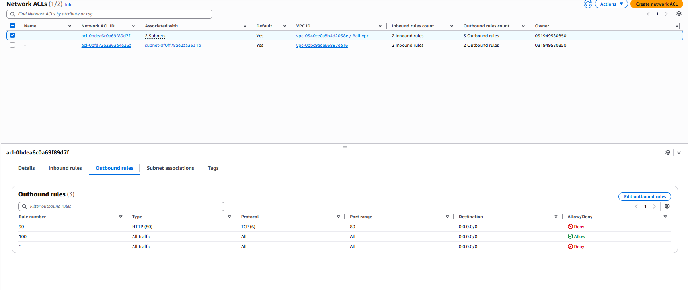
The outbound HTTP response is blocked while inbound traffic remains allowed.

## Step 6 - Validate the Results
- Repeat the same validation process.

1. Browsing http://Public-IP
2. Check the Nginx service. > sudo systemctl status nginx
3. Verify listening ports. > sudo ss -tulnp | grep nginx
4. Verify local connectivity. > nc -vz 127.0.0.1 80
5. Scan localhost. > nmap 127.0.0.1
6. Scan the public IP. > nmap -Pn -p 22,80 <Public-IP>

| Validation     | Result                |
| -------------- | --------------------- |
| Browser        | Blocked               |
| Nginx          | Running               |
| Local TCP Test | Connected             |
| Local Nmap     | 22 Open / 80 Open     |
| Public Nmap    | 22 Filtered / 80 Open |

The web server still accepts incoming connections, but outbound HTTP responses are blocked, preventing successful communication with external clients.

## Results Comparison

| Validation     | Inbound DENY              | Outbound DENY         |
| -------------- | ------------------------- | --------------------- |
| Browser        | ❌ Blocked                 | ❌ Blocked             |
| Nginx          | Running                   | Running               |
| Local TCP Test | Connected                 | Connected             |
| Local Nmap     | 22 Open / 80 Open         | 22 Open / 80 Open     |
| Public Nmap    | 22 Filtered / 80 Filtered | 22 Filtered / 80 Open |

## 💡 Lesson Learned
Unlike Security Groups, AWS Network ACLs are stateless firewalls. Inbound and outbound traffic are evaluated independently, meaning a request can be allowed while the corresponding response is blocked. This behavior requires explicit rules for both traffic directions when implementing subnet-level network controls.

# Troubleshooting
## Troubleshooting 1 - Unable to Connect to EC2 via SSH

- Problem

Unable to establish an SSH connection to the EC2 instance.
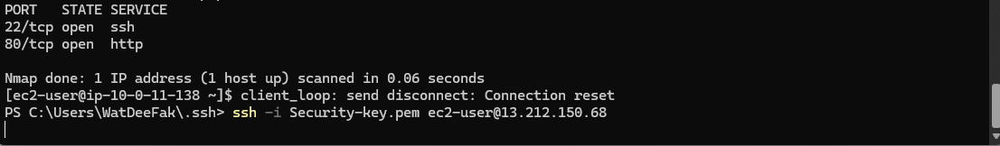
- Cause

The client's public IP address changed, causing the existing Security Group SSH rule (My IP) to no longer match the current IP address.
- Solution

Remove old ssh and Updated the Security Group inbound SSH rule with the current My IP address. After updating the rule, SSH connectivity was successfully restored.
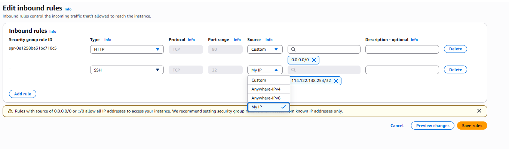
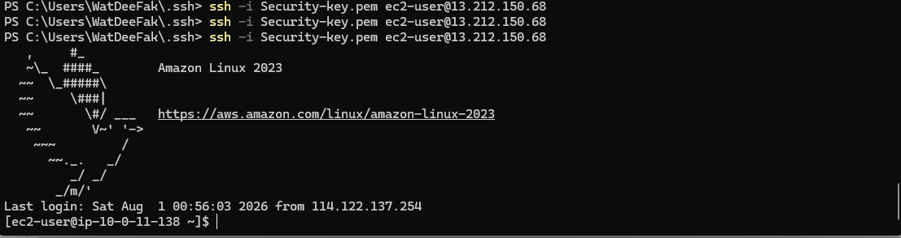

## Troubleshooting 2 - Unable to Access the Nginx Web Page

- Problem

The Nginx web page continued loading and never displayed the default welcome page.
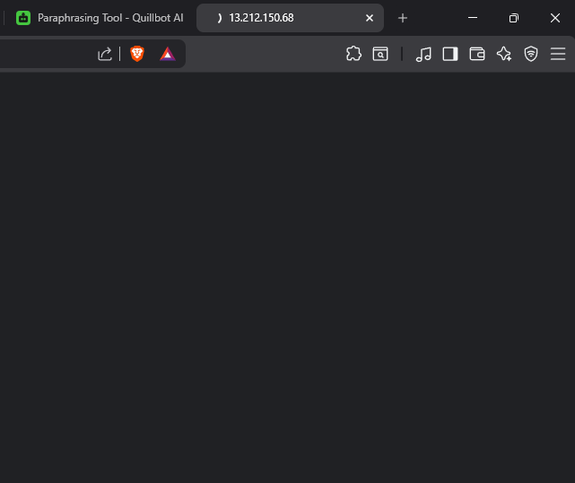
- Cause 

The Brave browser automatically upgraded HTTP requests to HTTPS using the Upgrade connections to HTTPS feature, while the web server only served HTTP traffic.
- Solution

(I'm using Brave browser) Disabled the Upgrade connections to HTTPS browser setting and accessed the website using the HTTP URL. The Nginx welcome page loaded successfully afterward.
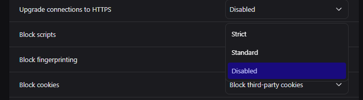

## AWS Services Used

- Amazon EC2
- Amazon VPC

## Resource Cleanup

To avoid unexpected AWS charges, remove the following resources after completing the project:

- Terminate the EC2 instance.
- Delete the custom VPC.

## Key Takeaways

- Learned how TCP connectivity differs from application availability.
- Compared Security Groups (stateful) and Network ACLs (stateless) through hands-on experiments.
- Used Netcat and Nmap to validate TCP connectivity and analyze firewall behavior.
- Practiced troubleshooting from the application layer to the network layer.

